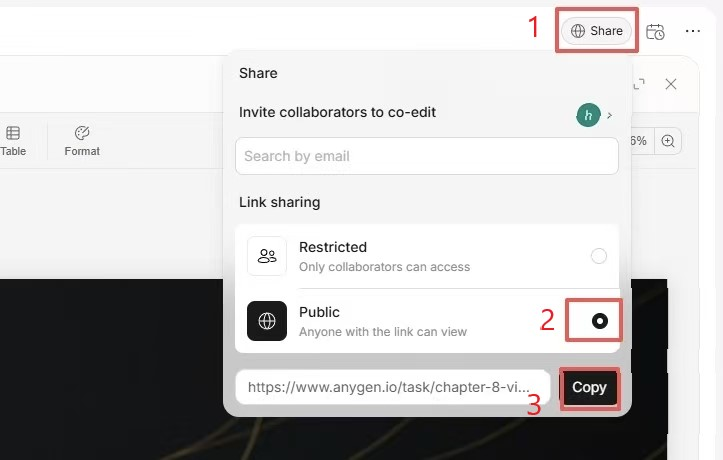

# 快速使用指南

## 🎯 安装和启动

### 第 1 步：安装依赖（2-3 分钟）

```bash
cd d:\anygen-ppt\anygen-ppt-vue
npm install
```

### 第 2 步：启动开发服务器（1 分钟）

```bash
npm run dev
```

输出应该显示：
```
  VITE v5.0.8  ready in XXX ms

  ➜  Local:   http://localhost:5173/
```

### 第 3 步：打开浏览器

访问：http://localhost:5173

---

## 📖 使用教程

### 第 1 步：获取 AnyGen 分享链接

访问 AnyGen 网站，找到要导出的任务后，按以下步骤获取分享链接：



**操作步骤：**

1. **点击 Share 按钮** - 在 AnyGen 任务页面右上角
2. **选择 Public** - 确保链接可以被访问
3. **复制分享链接** - 复制 URL 以供下一步使用

链接格式应为：`https://www.anygen.io/task/xxx-xxx?share_id=数字`

### 第 2 步：在本应用中提交导出请求

打开应用首页，按以下步骤操作：

1. **粘贴 AnyGen 链接** - 将复制的链接粘贴到 "AnyGen 链接" 输入框
2. **输入接收邮箱** - 填写接收导出 PPT 的邮箱地址
3. **输入卡密** - 输入您的卡密（密钥）
4. **点击开始导出** - 系统开始处理任务

### 第 3 步：等待导出完成

- 页面会显示实时进度：
  - ⏳ **排队中** - 任务已提交，等待处理
  - ⚙️ **处理中** - 系统正在导出 PPT
  - ✓ **导出完成** - 可以直接下载或通过邮件接收

---

## 🔑 卡密查询

如果不确定卡密是否有效，可以：

1. 点击首页底部 **"查询卡密状态"** 链接
2. 输入卡密
3. 查看卡密的状态、最大使用次数、已使用次数和剩余次数

---

## 👨‍💼 管理后台

使用密码登录管理后台：

1. 访问：http://localhost:5173/admin
2. 输入管理员密码
3. 进入仪表盘查看：
   - 📊 统计信息（总任务、待处理、已完成、失败）
   - 📋 最近任务列表
   - 🔑 密钥管理
   - ⚙️ 系统设置

---

## ✅ 验证清单

启动应用后，检查以下功能是否正常：

- [ ] 首页能正常显示 Element Plus 表单
- [ ] 能填写并提交导出请求
- [ ] 表单验证工作正确（邮箱格式、必填项等）
- [ ] 卡密查询页面能显示卡密信息
- [ ] 管理后台能登录且显示数据
- [ ] 统计卡片有美观的渐变背景
- [ ] 页面在不同设备上响应式显示正确

---

## 🎨 UI 库说明

本项目使用 **Element Plus** UI 库，特点：

✨ 现代化设计  
✨ 完整的组件库  
✨ 响应式支持  
✨ 深色/浅色主题支持（可选）  

所有页面已完全迁移到 Element Plus，无 Tailwind CSS 依赖。

---

## 📁 项目文件夹结构

```
anygen-ppt-vue/
├── src/
│   ├── views/                 # 页面组件
│   │   ├── HomePage.vue       # 导出表单
│   │   ├── LoginPage.vue      # 管理员登录
│   │   ├── QueryPage.vue      # 卡密查询
│   │   └── AdminLayout.vue    # 管理后台
│   ├── components/            # 可复用组件
│   ├── services/              # API 服务
│   ├── stores/                # Pinia 状态管理
│   ├── router/                # Vue Router 配置
│   └── main.ts                # 应用入口
├── public/                    # 静态资源
│   └── jiaocheng1.jpg        # 教程图片
├── package.json               # 依赖管理
└── vite.config.ts            # Vite 配置
```

---

## 🚀 生产构建

完成测试后，编译生产版本：

```bash
npm run build
```

生成的 `dist/` 文件夹即为生产文件，可部署到服务器。

---

## ❓ 常见问题

**Q: 安装时出错？**
A: 确保 Node.js 版本 >= 16，运行 `npm cache clean --force` 后重试。

**Q: 页面加载很慢？**
A: 首次加载会编译所有组件，刷新页面试试。生产构建会快很多。

**Q: 卡密不生效？**
A: 检查卡密是否有剩余次数（使用"查询卡密状态"功能确认）。

**Q: 如何修改默认密码？**
A: 后端配置中设置（需要后端实现）。

---

## 📞 技术支持

- 查看 src/ 目录下各页面的源代码
- 参考 Element Plus 官方文档：https://element-plus.org
- 项目代码注释详细，易于修改

---

**准备好了吗？运行 `npm install && npm run dev` 开始使用！** ✨